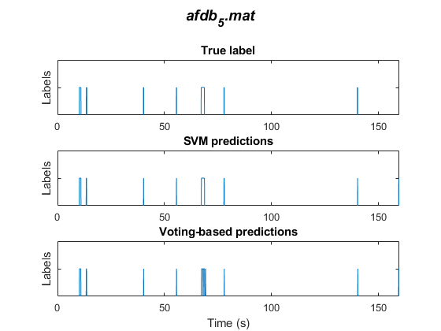
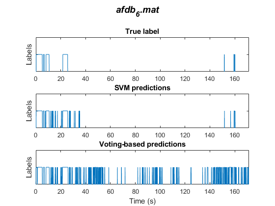
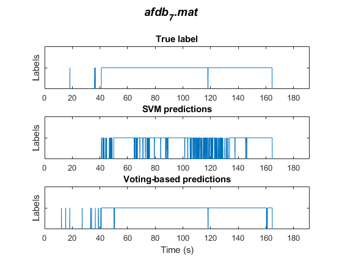
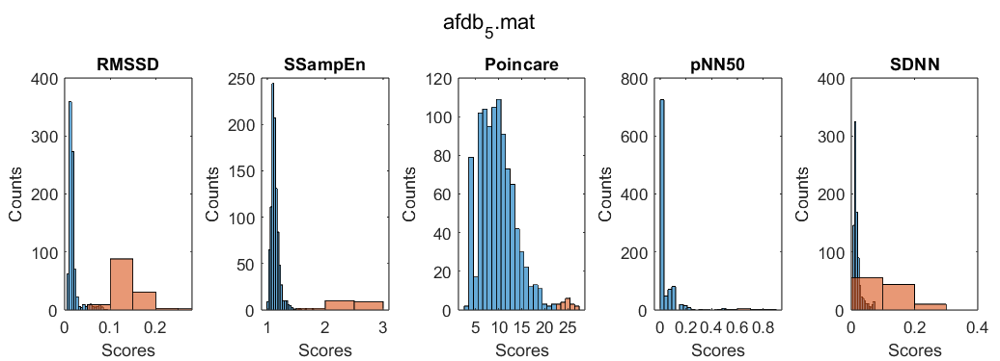
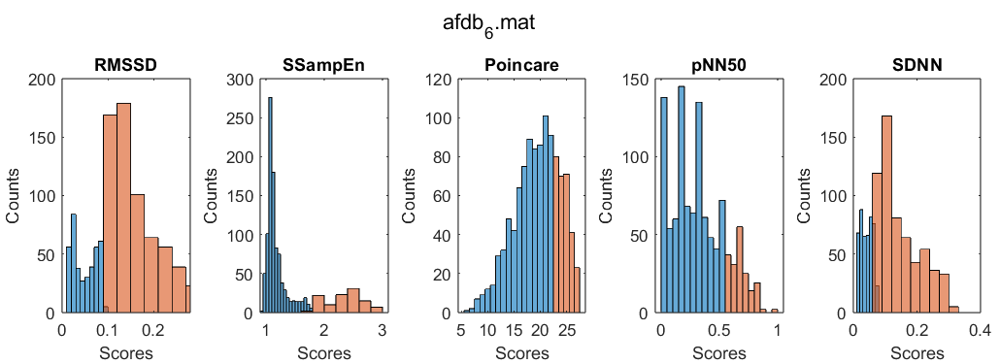
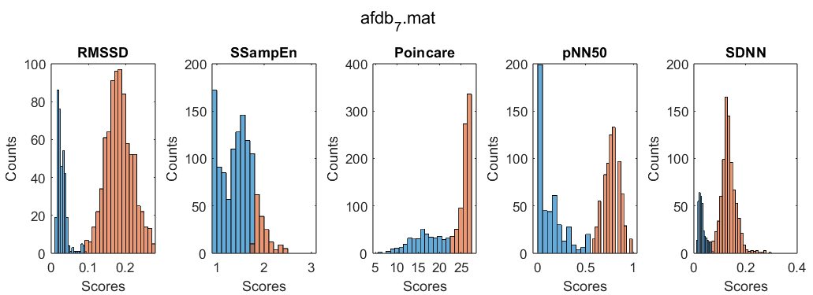

# Atrial Fibrillation Detector

MATLAB experiments for detecting atrial fibrillation (AF) from RR intervals—the time between consecutive heartbeats. The project explores algorithms discussed in *Bioelectrical Signal Processing in Cardiac and Neurological Applications* by L. Sörnmo and P. Laguna.

The code extracts features from windows of RR intervals and compares three approaches: a threshold on a single feature, majority voting across feature thresholds, and a support vector machine (SVM). It includes seven MAT files for training and evaluation, plotting helpers, feature selection, and parameter searches.

This is an experimental project for studying AF detection, with no established clinical validation.

## Results - Predictions





## Results - Feature Performance

A higher separation between positive and negative classes implies higher performing features.





## Requirements

- MATLAB with support for string arrays and `classdef` classes. A minimum release is not specified or tested.
- Statistics and Machine Learning Toolbox for SVM training and cross-validation (`fitcsvm`, `kfoldPredict`).
- Parallel Computing Toolbox for the grid-search methods (`parpool`, `parfor`, `parallel.pool.DataQueue`).

The single-feature and voting examples can be run without invoking the SVM or parallel grid-search methods. GNU Octave compatibility has not been verified.

## Repository layout

| Path | Purpose |
| --- | --- |
| `AF_RR_intervals/afdb_1.mat` … `afdb_7.mat` | Included RR-interval datasets. |
| `data_inspection.m` | Plot recordings, Poincaré diagrams, filtering examples, and heart rate. |
| `features_test.m` | Train and evaluate individual feature thresholds. This is an experiment script, not an automated test suite. |
| `voting.m` | Feature selection, parameter search, and majority-vote detection. |
| `SVM.m` | Feature selection, cross-validated parameter search, and SVM detection. |
| `src/modelling.m` | Feature extraction, threshold training/prediction, filtering, and SVM methods. |
| `src/votingdetector.m` | Train feature thresholds and combine their predictions by majority vote; ties produce label `0`. |
| `src/inspect.m` | Plotting, window labels, heart-rate calculation, and F1 evaluation. |
| `src/RMSSD.m`, `src/SDNN.m`, `src/pNN50.m`, `src/Poincare.m`, `src/SSampEn.m` | Individual feature implementations. |

## Getting started

Open MATLAB and set the current folder to the repository root. Add the data and source directories to the MATLAB path:

```matlab
addpath('AF_RR_intervals');
addpath('src');

% View a recording.
inspect.plotdata('afdb_6.mat');
```

For the supplied experiments, open `data_inspection.m`, `features_test.m`, `voting.m`, or `SVM.m` in the MATLAB Editor and run the relevant `%%` section. Review the filenames and parameters first. Running all of `SVM.m` or `voting.m` also runs feature selection and grid search, which can take substantial time. The top-level scripts begin by clearing the workspace.

### Train and evaluate an RMSSD threshold

Run this example from the repository root after adding the paths above:

```matlab
trainingdata = {'afdb_1.mat', 'afdb_2.mat', 'afdb_3.mat', 'afdb_4.mat'};
validationdata = 'afdb_6.mat';

windowsize = 30;
stepsize = 30;
feature = "RMSSD";
binsize = 0;          % Unused for RMSSD; Poincare requires a positive value.
usefilter = 1;
points = 10;
filterthreshold = 0.2;

threshold = modelling.train(trainingdata, windowsize, stepsize, ...
    feature, binsize, usefilter, points, filterthreshold);
result = modelling.predict(validationdata, windowsize, stepsize, ...
    feature, binsize, usefilter, points, filterthreshold, threshold);

% Single-feature output has columns [feature score, predicted label].
predictions = result(:, 2);
labels = inspect.getlabels(validationdata, windowsize, stepsize);
fprintf('F1 score: %.4f\n', inspect.f1score(labels, predictions));
inspect.compare(validationdata, predictions, windowsize, stepsize, ...
    points, filterthreshold);
```

Threshold training tests 1,000 values between the minimum and maximum training scores and selects the threshold with the best training F1 score. Scores above that threshold are classified as AF. Voting and SVM prediction methods return a label vector directly.

## Data and parameters

The training and evaluation methods expect MAT files containing `rr` and `targetsRR`, with corresponding interval and label entries. Labels are `0` for normal rhythm and `1` for AF. The inspection scripts also use `qrs`, `targetsQRS`, and `Fs`; they calculate RR intervals as `diff(qrs) / Fs` and heart rate as `60 ./ rr`, so those workflows treat RR intervals as seconds and QRS positions as sample indices.

To use another recording, place its MAT file on the MATLAB path and update the training/validation filenames. Keep training recordings separate from recordings used for final evaluation. Dataset provenance and redistribution terms are not documented in the repository.

| Parameter | Meaning |
| --- | --- |
| `windowsize` | Window length parameter in RR-interval entries, rather than seconds; see the indexing limitation below. |
| `stepsize` | Number of RR-interval entries between window starts. |
| `feature` / `features` | One feature name or an array of names: `RMSSD`, `SDNN`, `pNN50`, `Poincare`, `SSampEn`. |
| `filter` / `usefilter` | `1` enables the custom RR replacement filter; `0` disables it. |
| `points` | Block-size parameter for the custom filter. |
| `filterthreshold` | Relative deviation threshold used by the filter. |
| `binsize` | Poincaré grid spacing, in the same units as `rr`; the grid spans 0 to 3. |

RMSSD measures the root mean square of successive interval differences; SDNN computes interval standard deviation; pNN50 returns the fraction of successive differences greater than `0.05` seconds. The Poincaré feature counts occupied bins of consecutive interval pairs. SSampEn implements a pair-match probability divided by the mean interval.

## Evaluation and known limitations

`inspect.f1score` computes binary F1 with AF as the positive class. `inspect.compare` plots RR intervals, reference labels, predictions, and F1. `inspect.scoreDistribution` groups scores by **predicted** class, not reference class.

Consider these implementation details before interpreting results:

- Window indexing is inconsistent: RMSSD, SDNN, pNN50, and training labels use `i:i+windowsize` (one extra entry), while SSampEn and evaluation labels use `i:i+windowsize-1`. Poincaré also accesses the following interval for each pair.
- SSampEn uses tolerances described in milliseconds (`30`, increasing by `5`) but receives RR values without unit conversion. This conflicts with the seconds-based conventions elsewhere in the project.
- `modelling.medianfilter` replaces outlying values with the block's central sample; it does not compute a median. `inspect.compare` always applies this filter to the plotted RR sequence, even if prediction filtering was disabled.
- Some sections in `features_test.m` pass the full two-column result to `inspect.compare`. Pass `result(:, 2)` for single-feature evaluation, as in the example above.
- SVM cross-validation splits extracted windows rather than holding out whole recordings. Feature selection and voting grid search optimize against the chosen validation recording; use an independent test set for final performance assessment.

There is no automated test suite or documented benchmark result. Experiment outputs are MATLAB workspace variables, figures, and console messages; the scripts do not save trained models or reports automatically.
